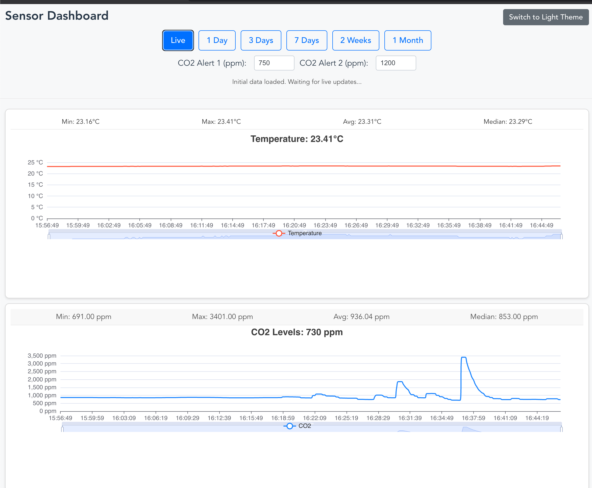

# CO2 & Temperature Monitor Dashboard

This application reads CO2 and temperature data from a connected **Даджет MT8057** (or compatible) HID-based sensor device, stores it, and presents it through a web interface with real-time charts and historical data views. It includes features like configurable alert thresholds for CO2 levels with browser notifications and a switchable light/dark theme.

The project is an enhanced version inspired by initial work found at https://github.com/dmage/co2mon, specifically adapted and extended for devices like the MT8057.



## Features

*   **HID Device Integration:** Reads raw data directly from CO2/temperature USB HID sensors, with a primary focus on the **Даджет MT8057**.
*   **Data Decoding:** Implements a specific decoding algorithm (shuffle, XOR, nibble swap, chained subtraction) tailored to devices like the MT8057, with conditional logic based on the device's release number.
*   **Data Persistence:** Stores sensor readings (timestamp, temperature, CO2) in an SQLite database.
*   **Web Interface (Vue.js):**
    *   Real-time data display on interactive charts (Temperature and CO2).
    *   Charts are synchronized for tooltip and crosshair interactions.
    *   Displays current sensor values in chart titles.
    *   Calculates and displays aggregate statistics (Min, Max, Average, Median) for the visible data range on charts. Statistics update dynamically with chart zoom/pan.
    *   Historical data browsing with time range filters (1 Day, 3 Days, 7 Days, 2 Weeks, 1 Month).
    *   DataZoom state (zoom level and scroll position) is preserved during live updates.
    *   Switchable UI theme (Light/Dark) with preference saved in `localStorage`.
*   **Backend API (Go & Gin):**
    *   Serves historical data and the latest N data points via HTTP GET requests.
    *   Broadcasts new sensor readings to connected clients via WebSockets.
*   **CO2 Alerts:**
    *   User-configurable warning and critical thresholds for CO2 levels.
    *   Visual indicators in the UI when thresholds are breached.
    *   Browser notifications for CO2 alerts (one notification per alert level crossing until the level drops below the threshold).

## Technology Stack

*   **Backend:**
    *   Go
    *   Gin-gonic (HTTP framework)
    *   [github.com/sstallion/go-hid](https://github.com/sstallion/go-hid) (for HID communication)
    *   [github.com/mattn/go-sqlite3](https://github.com/mattn/go-sqlite3) (SQLite driver)
    *   [github.com/gorilla/websocket](https://github.com/gorilla/websocket) (WebSocket implementation)
*   **Frontend:**
    *   Vue.js 3 (with Vite)
    *   ECharts ([vue-echarts](https://github.com/ecomfe/vue-echarts)) for charting
    *   JavaScript (ES6+)
    *   HTML5, CSS3

## Project Structure

*   `main.go`: Core backend application logic, including HID interaction, data decoding, database operations, API endpoints, and WebSocket handling.
*   `frontend/`: Contains the Vue.js frontend application.
    *   `src/`: Source files for the Vue app.
        *   `App.vue`: Main application component, layout, and core frontend logic.
        *   `components/`: Reusable Vue components (e.g., `TemperatureChart.vue`, `CO2Chart.vue`).
        *   `main.js`: Entry point for the Vue application.
        *   `style.css`: Global styles.
    *   `public/`: Static assets.
    *   `index.html`: Main HTML file for the frontend.
    *   `vite.config.js`: Vite build configuration.
    *   `package.json`: Frontend dependencies and scripts.

## Setup and Running

### Prerequisites

*   Go (version 1.18+ recommended)
*   Node.js and npm (for the frontend)
*   HIDAPI library installed on your system:
    *   **Linux:** `sudo apt-get install libhidapi-dev` or equivalent for your distribution.
    *   **macOS:** `brew install hidapi`
    *   **Windows:** HIDAPI is often included, or drivers may be needed for specific devices.
*   The **Даджет MT8057** (or compatible CO2/Temperature USB HID device) connected.

### Backend

1.  Navigate to the project root directory.
2.  Install Go dependencies:
    ```bash
    go mod tidy
    ```
3.  Run the backend server:
    ```bash
    go run main.go
    ```
    The server typically starts on `http://localhost:8072` (can be configured via flags if implemented).

### Frontend

1.  Navigate to the `frontend` directory:
    ```bash
    cd frontend
    ```
2.  Install Node.js dependencies:
    ```bash
    npm install
    ```
3.  Run the frontend development server (Vite):
    ```bash
    npm run dev
    ```
    The frontend will usually be available at `http://localhost:5173` (or another port specified by Vite) and proxies API/WebSocket requests to the backend.

## HID Device Access

*   On Linux, you might need to set up udev rules to grant non-root users access to the HID device. Example udev rule (place in `/etc/udev/rules.d/99-co2mon.rules`):
    ```
    SUBSYSTEM=="usb", ATTRS{idVendor}=="04d9", ATTRS{idProduct}=="a052", MODE="0666"
    ```
    (Replace `04d9` and `a052` with your device's actual Vendor ID and Product ID if different. Run `sudo udevadm control --reload-rules && sudo udevadm trigger` after creating the file.)
*   Ensure no other application is exclusively accessing the device.

## See also
  * [ZyAura ZG01C Module Manual](http://www.zyaura.com/support/manual/pdf/ZyAura_CO2_Monitor_ZG01C_Module_ApplicationNote_141120.pdf)
  * [RevSpace CO2 Meter Hacking](https://revspace.nl/CO2MeterHacking)
  * [Photos of the device and the circuit board](http://habrahabr.ru/company/masterkit/blog/248403/)
